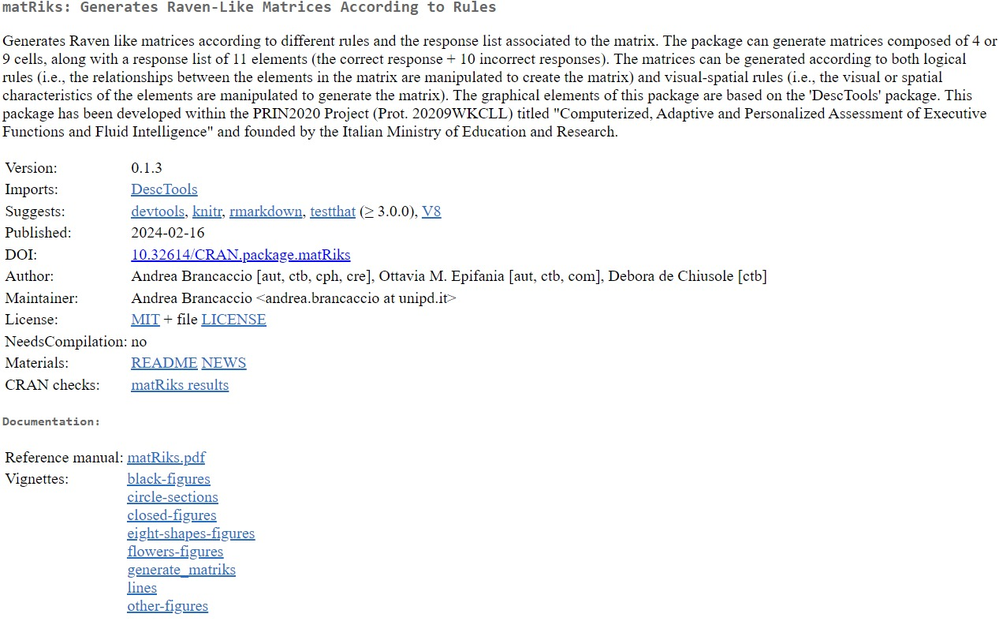

```{r setup, include=FALSE}
knitr::opts_chunk$set(echo = FALSE, comment = NA)
library(knitr)
library(kableExtra)
library(data.table)

hook_output <- knitr::knit_hooks$get("output")
knitr::knit_hooks$set(output = function(x, options) {
if (!is.null(n <- options$out.lines)) {
x <- xfun::split_lines(x)
if (length(x) > n) {
# truncate the output
x <- c(head(x, n), "....\n")
}
x <- paste(x, collapse = "\n")
}
hook_output(x, options)
})
knit_hooks$set(output = function(x, options) {
  # this hook is used only when the linewidth option is not NULL
  if (!is.null(n <- options$myline)) {
    x = xfun::split_lines(x)
    # any lines wider than n should be wrapped
    if (any(nchar(x) > n)) x = strwrap(x, width = n)
    x = paste(x, collapse = '\n')
  } else if (!is.null(n <- options$out.lines)) {
x <- xfun::split_lines(x)
if (length(x) > n) {
# truncate the output
x <- c(head(x, n), "....\n")
}
x <- paste(x, collapse = "\n")
}
  hook_output(x, options)
})
#devtools::install_github("https://github.com/OttaviaE/matRiks")
library(matRiks)
```


# All'inizio di tutto

## Raven e le regole generative

Misurare l'intelligenza fluida senza andare a toccare le conoscenze pregresse e bypassando tutto quello che si è appreso con il processo di acculturazione...ma come?

\pause
\vspace{1.5mm}
Analogie visive.. ma come? 

\pause

\centering 
\Large
Regole generative per manipolare i rapporti visuo-spaziali o logici tra figure e oggetti

## Un esempio

\centering
\begin{tikzpicture}
        \imagenode[0.5]{img/completeExample.png}

\highlightbox[red,very thick]{0.12}{0.49}{0.85}{0.98}{red}{}{2-3}
\highlightbox[myGreen,very thick]{0.57}{0.52}{0.75}{.66}{myGreen}{}{3}
\highlightbox[green,very thick]{0.05}{0.01}{0.95}{0.45}{red}{}{4}
\end{tikzpicture}


## La matrice

\centering
\begin{tikzpicture}
			\imagenode[0.5]{img/matrix.png}
			\highlighttext{0.2}{0.9}{0.8}{1}{red}{Cambio forma \& Progressione numerica}{2}
			\highlightbox[red,very thick]{0.18}{0.65}{0.85}{0.9}{red}{}{2}
			\highlightbox[red,very thick]{0.18}{0.37}{0.85}{0.62}{red}{}{2}
			\highlightbox[red,very thick]{0.18}{0.11}{0.85}{0.35}{red}{}{2}
			\highlightbox[red,very thick]{0.18}{0.1}{0.36}{0.9}{red}{}{3}
			\highlightbox[red,very thick]{0.40}{0.1}{0.60}{0.9}{red}{}{3}
			\highlightbox[red,very thick]{0.64}{0.1}{0.83}{0.9}{red}{}{3}
			\highlighttext{0.1}{0.9}{0.4}{1}{red}{Progressione numerica}{3}
\end{tikzpicture}


## Le opzioni di risposta

\onslide<1->
\begin{textblock*}{4cm}(8.5cm,1cm)
\includegraphics[width =\linewidth]{img/matrix.png}
\end{textblock*}
	
		
\begin{tikzpicture}
\imagenode[0.4]{img/responses.png}
\highlightbox[myGreen,very thick]{0.52}{0.02}{0.73}{.4}{circle,myGreen}{}{2-}
\highlightbox[repetition,very thick]{0.52}{0.52}{0.73}{.86}{circle,myGreen}{}{3-}
\highlightbox[repetition,very thick]{0.78}{0.02}{0.98}{.4}{circle,myGreen}{}{3-}
\highlightbox[difference,very thick]{0.26}{0.52}{0.48}{.86}{circle,myGreen}{}{6-}
\highlightbox[wp,very thick]{0.01}{0.02}{0.21}{.4}{circle,myGreen}{}{5-}
\highlightbox[wp,very thick]{0.78}{0.52}{0.98}{.86}{circle,myGreen}{}{5-}
\highlightbox[wp,very thick]{0.28}{0.02}{0.48}{.4}{circle,myGreen}{}{5-}
\highlightbox[ic,very thick]{0.01}{0.52}{0.21}{.86}{circle,myGreen}{}{4-}
\end{tikzpicture}
		
\small 
\vspace{5mm}
		
\onslide<3->
\centering
\scalebox{.95}{
\begin{tabular}{p{3cm}p{10cm}}

\textcolor<3->{repetition}{Repetition} &  Ripetizione di una cella adiacente alla cella vuota\\ 
\textcolor<4->{ic}{Incomplete Correlate} &  `Quasi'' la risposta corretta \\
\textcolor<5->{wp}{Wrong Principle} &  Viene usata una regola non corretta per risolvere la matrice  \\
\textcolor<6->{difference}{Difference} &  Effetto pop-up\\
\end{tabular}
}


<!-- ## Regole generative -->

<!-- \scalebox{.65}{ -->
<!-- \begin{tabular}{p{3.2cm}p{4cm} p{9.5cm}} -->
<!-- \hline -->
<!-- \textbf{Categoria}	&	\textbf{Regola}	&	\textbf{Definizione}	\\\hline -->
<!-- Visuospaziale&       Completamento & Individuazione della porzione mancante di una figura	 \\ -->
<!-- &	Orientamento	&	Manipolazione dell'orientamento spaziale\\ -->
<!-- &	Forma	&	Manipolazione della forma  	\\ -->
<!-- &	Riempimento	&	Manipolazione del riempimento 	\\ -->
<!-- &	Dimensione & Manipolazione della dimensione	\\	 -->
<!-- &&\\ -->
<!-- \hline -->
<!-- Pre-inferenza	&	Addizione oggettuale	&	Sovrapposizione degli oggetti presenti in diverse celle	\\ -->
<!-- &	Sottrazione oggettuale	&	Cancellazione degli oggetti presenti in diverse celle	\\ -->
<!-- &&\\ -->
<!-- \hline -->
<!-- Logica & AND & La terza cella si ottiene dall'intersezione delle prime due\\ -->
<!-- & OR    & La terza cella si ottiene dall'unione delle prime due\\ -->
<!-- & XOR  & La terza cella si ottiene dall'unione delle prime due ma solo per gli elementi che non si	ripetono\\ -->
<!-- &&\\ \hline -->
<!-- Logica direzionale & Orizzontale & Le regole vengono applicate in orizzontale \\ -->
<!-- & Verticale & Le regole vengono applicate in verticale \\ -->
<!-- & Diagonale & Le regole vengono applicate contemporanemente in verticale e orizzontale \\\hline -->
<!-- \end{tabular}} -->

<!-- ## Distrattori -->

<!-- \onslide<1-> -->
<!-- \begin{textblock*}{4cm}(8.5cm,1cm) -->
<!-- \includegraphics[width =\linewidth]{img/matrix.png} -->
<!-- \end{textblock*} -->


<!-- \begin{tikzpicture} -->
<!-- \imagenode[0.4]{img/responses.png} -->
<!-- \highlightbox[myGreen,very thick]{0.52}{0.02}{0.73}{.4}{circle,myGreen}{}{2-} -->
<!-- \highlightbox[repetition,very thick]{0.52}{0.52}{0.73}{.86}{circle,myGreen}{}{3-} -->
<!-- \highlightbox[repetition,very thick]{0.78}{0.02}{0.98}{.4}{circle,myGreen}{}{3-} -->
<!-- \highlightbox[difference,very thick]{0.26}{0.52}{0.48}{.86}{circle,myGreen}{}{6-} -->
<!-- \highlightbox[wp,very thick]{0.01}{0.02}{0.21}{.4}{circle,myGreen}{}{5-} -->
<!-- \highlightbox[wp,very thick]{0.78}{0.52}{0.98}{.86}{circle,myGreen}{}{5-} -->
<!-- \highlightbox[wp,very thick]{0.28}{0.02}{0.48}{.4}{circle,myGreen}{}{5-} -->
<!-- \highlightbox[ic,very thick]{0.01}{0.52}{0.21}{.86}{circle,myGreen}{}{4-} -->
<!-- \end{tikzpicture} -->

<!-- \small  -->
<!-- \vspace{5mm} -->

<!-- \onslide<3-> -->
<!-- \centering -->
<!-- \scalebox{.95}{ -->
<!-- \begin{tabular}{p{3cm}p{10cm}} -->

<!-- \textcolor<3->{repetition}{Repetition} &  Ripetizione di una cella adiacente alla cella vuota\\  -->
<!-- \textcolor<4->{ic}{Incomplete Correlate} &  `Quasi'' la risposta corretta \\ -->
<!-- \textcolor<5->{wp}{Wrong Principle} &  Viene usata una regola non corretta per risolvere la matrice  \\ -->
<!-- \textcolor<6->{difference}{Difference} &  Effetto pop-up\\ -->
<!-- \end{tabular} -->
<!-- } -->

# Time goes by...

##

$$\text{Regole generative} + \text{Regole dei distrattori} = \text{Infinte matrici}$$

\pause

Il tempo passa... ma non è stato fatto un grande sforzo per rendere questo processo realmente accessibile

\pause

\begin{block}{Corvus}

Su \href{GitHub}{https://github.com/Thimbleby/Corvus} (e il maintainer è super carino :)!

Scritto in Javascript con una UI intuitiva... ma spostarsi dai default non è banale

\end{block}

\pause

\begin{block}{Sandia}

Non molto intuitiva

Non è più manutenuta

Gli stimoli prodotti sono molto basici
\end{block}


\pause

\begin{center}

\color{unipd}
Non permettono la generalizzabiltà del processo generativo!


\end{center}


# The mat`R`iks package

## mat`R`iks

```{r eval =FALSE, echo = TRUE}
install.packages("matRiks")
library(matRiks)
# how to generate an RMarkdown file with your matrices!
vignette("generate_matriks")
```


```{r out.width="100%", fig.align='center'}

```

<!-- Generates $2 \times 2$ and $3 \times 3$ Raven-like matrices and the related set of distractors  -->

<!-- Allows for concatenating figures together $\rightarrow$ an infinite number of figures is in the midst -->


<!-- Allows for creating multi-layer matrices by combining concatenating single-layer matrices together  -->


## Regole disponibili


::: columns

:::: column

\centering

Cambi di dimensione, `size`

\begin{figure}
\centering

```{r, echo = F, eval = T, out.width="35%"}
a = mat_apply(maxi(), hrules = "size")

par(mfrow =c(1, 3) ,
        mar = c(6,5,5,5))

draw(a$Sq1); draw(a$Sq2); draw(a$Sq3)

```


\end{figure}


\centering

Cambi di riempimento, `shade`

\begin{figure}
\centering

```{r, echo = F, eval = T, out.width="35%"}
a = mat_apply(maxi(), hrules = "shade")

par(mfrow =c(1, 3) ,
        mar = c(6,5,5,5))

draw(a$Sq1); draw(a$Sq2); draw(a$Sq3)

```


\end{figure}


\centering
Cambi di forma, `shape`

\begin{figure}
\centering

```{r, echo = F, eval = T, out.width="35%"}
a = mat_apply(cof(s_lily(),
                  square(),
                  circle()), hrules = "shape")

par(mfrow =c(1, 3) ,
        mar = c(6,5,5,5))

draw(a$Sq1); draw(a$Sq2); draw(a$Sq3)

```


\end{figure}


\centering

Cambi di orientamento, `rotate`

\begin{figure}
\centering

```{r, echo = F, eval = T, out.width="35%"}
a = mat_apply(pacman(), hrules = "rotate.inv")

par(mfrow =c(1, 3) ,
        mar = c(6,5,5,5))

draw(a$Sq1); draw(a$Sq2); draw(a$Sq3)

```


\end{figure}
::::


:::: column

\centering

Cambi di margini, `lty`


\begin{figure}
\centering

```{r, echo = F, eval = T, out.width="35%"}
a = mat_apply(maxi(), hrules = "lty")

par(mfrow =c(1, 3) ,
        mar = c(6,5,5,5))

draw(a$Sq1); draw(a$Sq2); draw(a$Sq3)

```


\end{figure}

\centering

AND ($\cap$), `AND`

\begin{figure}
\centering

```{r, echo = F, eval = T, out.width="35%"}
size.x = 8
size.y = 4
pos.x = 0
shd = NA
lty = 1
lwd = 3

par(mfrow =c(1, 3) ,
        mar = c(6,5,5,5))

a = mat_apply(cof(luck(pos.x = pos.x + size.x, pos.y = pos.x, rot = pi,
        size.x = size.x, size.y = size.y, shd = shd, lty = lty,
        lwd = lwd), luck(pos.x = pos.x - size.x, pos.y = pos.x,
        rot = -pi, size.x = size.x, size.y = size.y, shd = shd,
        lty = lty, lwd = lwd), luck(pos.x = pos.x, pos.y = pos.x +
        size.x, rot = -pi, size.x = size.y, size.y = size.x,
        shd = shd, lty = lty, lwd = lwd), luck(pos.x = pos.x,
        pos.y = pos.x - size.x, rot = -pi, size.x = size.y, size.y = size.x,
        shd = shd, lty = lty, lwd = lwd)), hrules = "AND")

draw(a$Sq1); draw(a$Sq2); draw(a$Sq3)

```
\end{figure}

\centering

OR ($\cup$), `OR`

\begin{figure}
\centering

```{r, echo = F, eval = T, out.width="35%"}
size.x = 8
size.y = 4
pos.x = 0
shd = NA
lty = 1
lwd = 3

par(mfrow =c(1, 3) ,
        mar = c(6,5,5,5))

a = mat_apply(cof(luck(pos.x = pos.x + size.x, pos.y = pos.x, rot = pi,
        size.x = size.x, size.y = size.y, shd = shd, lty = lty,
        lwd = lwd), luck(pos.x = pos.x - size.x, pos.y = pos.x,
        rot = -pi, size.x = size.x, size.y = size.y, shd = shd,
        lty = lty, lwd = lwd), luck(pos.x = pos.x, pos.y = pos.x +
        size.x, rot = -pi, size.x = size.y, size.y = size.x,
        shd = shd, lty = lty, lwd = lwd), luck(pos.x = pos.x,
        pos.y = pos.x - size.x, rot = -pi, size.x = size.y, size.y = size.x,
        shd = shd, lty = lty, lwd = lwd)), hrules = "OR")

draw(a$Sq1); draw(a$Sq2); draw(a$Sq3)

```


\end{figure}

\centering

XOR ($\Delta$), `XOR`

\begin{figure}
\centering

```{r, echo = F, eval = T, out.width="35%"}
size.x = 8
size.y = 4
pos.x = 0
shd = NA
lty = 1
lwd = 3

par(mfrow =c(1, 3) ,
        mar = c(6,5,5,5))

a = mat_apply(cof(luck(pos.x = pos.x + size.x, pos.y = pos.x, rot = pi,
        size.x = size.x, size.y = size.y, shd = shd, lty = lty,
        lwd = lwd), luck(pos.x = pos.x - size.x, pos.y = pos.x,
        rot = -pi, size.x = size.x, size.y = size.y, shd = shd,
        lty = lty, lwd = lwd), luck(pos.x = pos.x, pos.y = pos.x +
        size.x, rot = -pi, size.x = size.y, size.y = size.x,
        shd = shd, lty = lty, lwd = lwd), luck(pos.x = pos.x,
        pos.y = pos.x - size.x, rot = -pi, size.x = size.y, size.y = size.x,
        shd = shd, lty = lty, lwd = lwd)), hrules = "XOR")

draw(a$Sq1); draw(a$Sq2); draw(a$Sq3)

```


\end{figure}

::::


:::


## Generare gli stimoli
\scriptsize

```{r  echo = T, eval = F, out.width="80%"}
my_mat1 = mat_apply(cof(pentagon(),square(size.x = 16, size.y = 16), 
                        circle(size.x = 15)),
          hrules = "shape", # regola applicata attraverso le colonne
          vrules = "lty") # regola applicata attraverso le righe
draw(my_mat1, hide = TRUE)

```


\begin{figure}
\centering
```{r  echo = F, eval = T, out.width="78%"}
# genera una matrice
my_mat1 = mat_apply(cof(pentagon(), square(size.x = 16, size.y = 16),
              
                  circle(size.x = 15)),
                hrules = "shape", # regola applicata attraverso le colonne
               vrules = "lty") # regola applicata attraverso le righe
# disegna la matrice
draw(my_mat1, hide = TRUE)

```

\end{figure}


## Generare stimoli più complessi 

\scriptsize

```{r  echo = T, eval = F, out.width="90%"}
my_mat2 = mat_apply(axe(size.x=9), hrules ="rotate", vrules = "rotate")
my_mat3 = mat_apply(square(size.x = 5),  hrules = "shade")
the_mat = com(my_mat1, my_mat2, my_mat3) # combina le matrici
draw(the_mat, hide = TRUE)
```


\begin{figure}
```{r  echo = F, eval = T, out.width="80%"}
my_mat2 = mat_apply(axe(size.x=9), c("rotate"), "rotate")
my_mat3 = mat_apply(square(size.x = 5), c( "shade"))
the_mat = com(my_mat1, my_mat2, my_mat3)
draw(the_mat, hide = TRUE)
```
\end{figure}


## A ogni stimolo i suoi distrattori 
\scriptsize
```{r, echo =TRUE, eval = FALSE, out.width="80%"}
my_responses = response_list(the_mat, seed = 5)
draw(my_responses, main = T)
```

\begin{figure}
```{r, out.width="80%"}
my_responses = response_list(the_mat, seed = 5)
draw(my_responses, main = T)
```
\end{figure}

## Tutto insieme


```{r, out.width="60%", fig.align='center'}
draw(the_mat, hide = TRUE)
```

\scriptsize
```{r, out.width="50%", fig.align='center'}
par(mfrow = c(1, 5))
draw(my_responses$correct) 
draw(my_responses$ic_flip)
draw(my_responses$difference)
draw(my_responses$r_left)
draw(my_responses$wp_matrix)
```


:::


# Perché?

## 

Estremante facile da usare, rende la generazione degli stimoli accessibile a tutt*

Costringe a pensare a livello teorico agli stimoli che si vogliono generare, alla loro complessità, alle loro caratteristiche

Il codice rimane e si può inserire all'interno di un RMarkdown o [quarto](https://ottaviae.github.io/presentations/giornata-sviluppo/esempi.html) per avere stimoli e distrattori sempre insieme 


